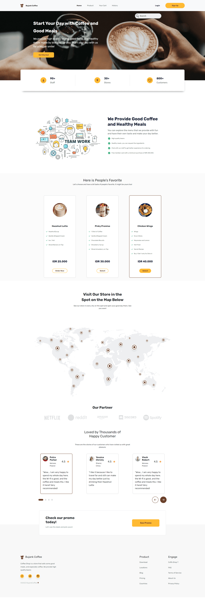
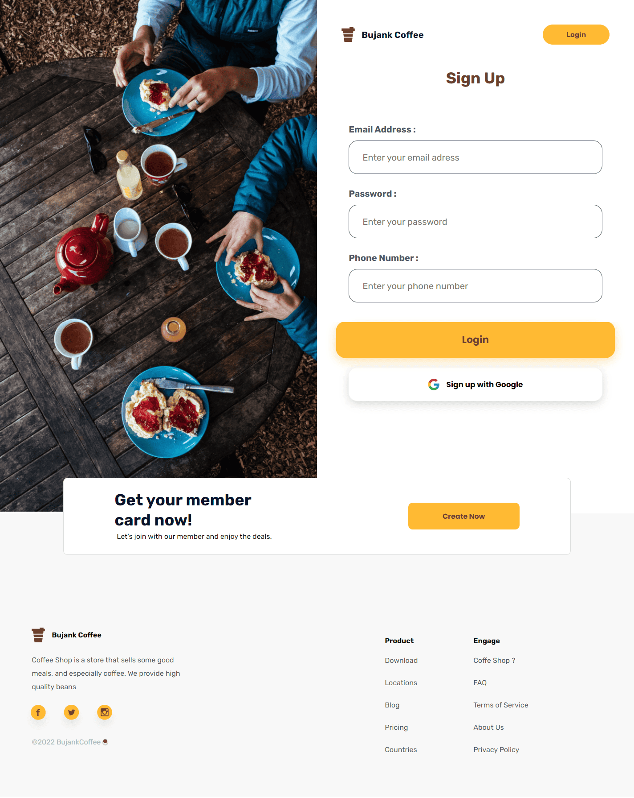
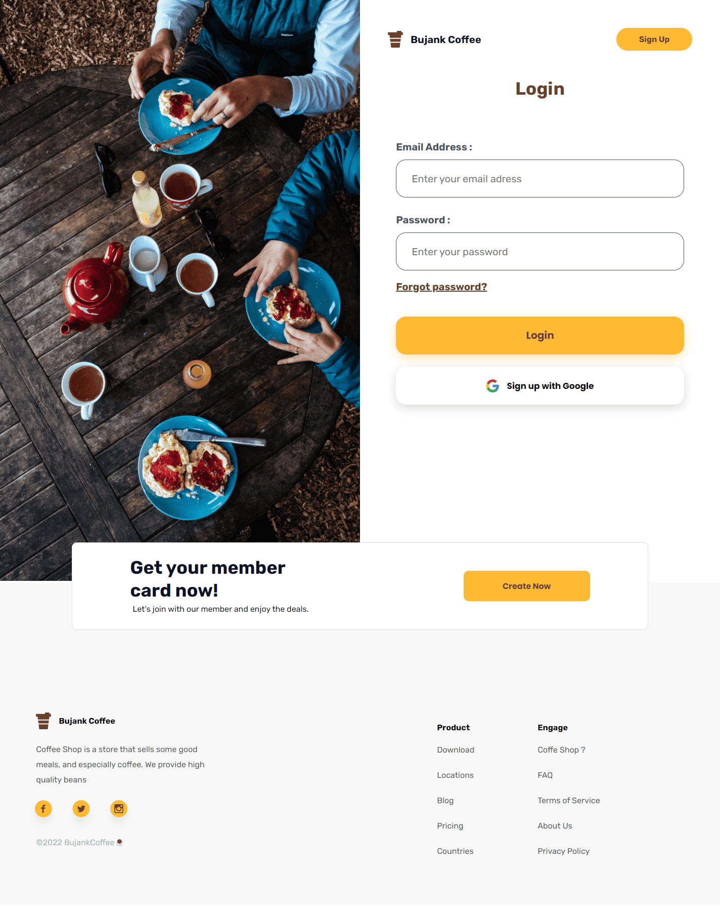
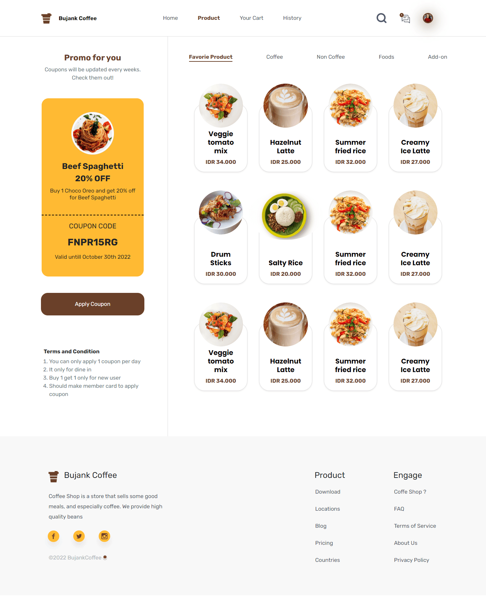
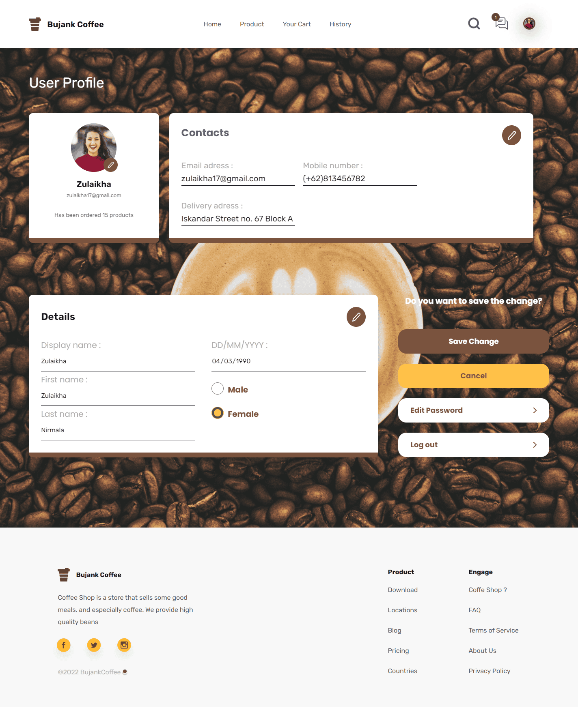

<a id="readme-top"></a>

<div align="center">
  <h2><u>BUJANK C☕FFEE - FRONTEND </u></h2>
</div>

<br>
<br>

# About The Project

<p>Bujank Coffee is everyone can drinks</p>

## Home



## Sign Up



## Login



## Product



## Profile



<h2 align="left">Built With</h2>

<p align="left">
  <a href="https://skillicons.dev">
    
  </a>
</p>


## Features

1. Responsive
2. Perfomance Testing with Lighthouse
3. HTML and CSS only

<!-- GETTING STARTED -->

# Getting Started

1. Download this Project or you can type
   `https://github.com/imbasri-dev/bujank_coffee_FE/archive/refs/heads/master.zip`
2. Open IDE or Click index.html
3. Bujank Coffee is Running
<!--
## Prerequisites
-->

## Installation

1. Clone the repo

    ```sh
    git clone https://github.com/imbasri-dev/bujank_coffee_FE.git
    ```

2. Open IDE or Click index.html
3. Bujank Coffee is Running

## Related Project

-   Frontend Deploy [`here`](https://bujank-coffee.netlify.app/)

-   Backend API Documentation [`here`](https://documenter.getpostman.com/view/23706970/2s847ESaNS)

<p align="center"><sub><b>&copy;2022❤️BujankCoffee☕</b></sub> </p>
